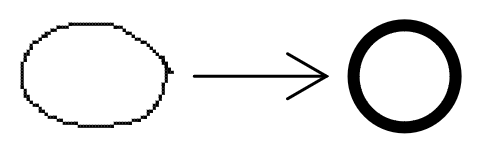

# PictionaTriche

Bienvenue dans le projet PictionaTriche, une fusion créative entre le dessin géométrique et par l'intelligence artificielle (IA).

## Fonctionnalités : Dessin Géométrique Intelligent

Transformez vos simples croquis en œuvres géométriques parfaites grâce à notre IA avancée. Commencez à dessiner, et observez comment le tableau interactif complète intelligemment la forme géométrique, ajoutant des détails de manière fluide.

## Comment ça marche :
    - Commencez à dessiner une forme géométrique sur le tableau interactif.
    - L'IA analyse vos traits et complète la forme de manière intelligente.
    - Obtenez des dessins géométriques impeccables en un clin d'œil !

## Licence

Ce projet est sous licence [MIT](LICENSE)

---

**Rejoignez-nous dans cette aventure artistique et technologique unique. Que le dessin commence !**
